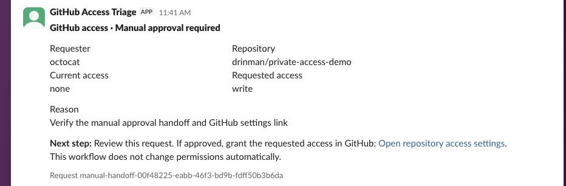
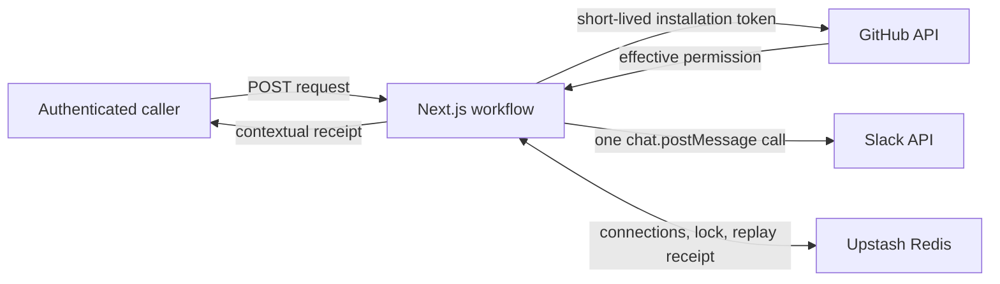

# GitHub Access Request Triage

GitHub Access Request Triage checks a person’s effective permission on one
private GitHub repository, posts an approval-ready summary to Slack, and
returns a contextual execution receipt.

The app stops at the human decision boundary. It never grants, changes, or
revokes GitHub access.

## Live demo

| Surface | Value |
| --- | --- |
| Production | https://github-access-triage.vercel.app |
| Public readiness | https://github-access-triage.vercel.app/api/status |
| Trigger | `POST /api/access-requests` |
| Repository | `drinman/private-access-demo` |
| Slack destination | `#access-requests` (`C0BKXAWH6SK`) |

The trigger requires a rotatable Bearer secret sent separately with the
submission. The admin password stays private and is only used to reconnect
GitHub or Slack.

## Trigger it in 60 seconds

Set the secret supplied with the submission, generate a fresh request ID, and
run:

```bash
export ACCESS_TRIAGE_SECRET="sent-separately"
export REQUEST_ID="approval-$(date -u +%Y%m%dT%H%M%SZ)"

curl --fail-with-body --silent \
  --request POST "https://github-access-triage.vercel.app/api/access-requests" \
  --header "Authorization: Bearer $ACCESS_TRIAGE_SECRET" \
  --header "Content-Type: application/json" \
  --data "{
    \"githubUsername\": \"octocat\",
    \"repository\": \"drinman/private-access-demo\",
    \"requestedPermission\": \"write\",
    \"reason\": \"Needs access to diagnose an integration failure\",
    \"slackChannel\": \"C0BKXAWH6SK\",
    \"requestId\": \"$REQUEST_ID\",
    \"includeDetails\": true
  }" | jq
```

The request does four things:

1. Authenticates the caller.
2. Reads `octocat`’s effective permission from GitHub.
3. Posts one approval card to `#access-requests`.
4. Returns the decision, provider context, step results, and Slack timestamp.

Run the same command again without changing `REQUEST_ID`. The response includes
`Idempotency-Replayed: true` and returns the original run without a second
Slack post.

## Verified production receipt

The production acceptance run completed on July 28, 2026 at 9:33 AM PT.

| Evidence | Observed value |
| --- | --- |
| GitHub user | `octocat` |
| Repository | `drinman/private-access-demo` |
| Requested permission | `write` |
| Effective permission | `none` |
| Decision | `approval_needed` |
| Slack message timestamp | `1785256423.998369` |
| Run ID | `d8ea4a43-e157-422c-af55-344b7107a1d3` |
| Replay | Same run ID and Slack timestamp, with no duplicate post |
| Public status | `ready`, with GitHub and Slack connected |



The same production pass also confirmed `401` for missing authentication, `400`
for an invalid payload, and `404 GITHUB_REPOSITORY_NOT_ACCESSIBLE` without a
Slack post for an inaccessible repository.

## Architecture



Vercel holds static credentials and security keys. Upstash Redis holds runtime
connection state, encrypted Slack credentials, owner-scoped idempotency
records, and the latest successful run time.

### Four design decisions

1. **Connect providers at runtime.** GitHub App installation plus user OAuth
   proves installation ownership. Slack OAuth returns the bot token. Provider
   tokens are never copied into source or returned by an API.
2. **Keep the action narrow.** GitHub is read-only. Slack gets only
   `chat:write`. Production requests are limited to the configured demo
   repository and channel.
3. **Stop before access changes.** The workflow gathers context and writes an
   approval card. A person makes the permission decision.
4. **Report uncertain delivery honestly.** Owner-scoped idempotency prevents
   normal duplicate posts. The receipt still distinguishes confirmed,
   retryable, partial, and indeterminate outcomes because Slack and Redis do
   not share a transaction.

See [docs/technical-design.md](docs/technical-design.md) for the OAuth proof,
permission model, idempotency state machine, failure semantics, and security
boundaries.

## Local setup and OAuth

### Requirements

- Node.js `24.x`
- pnpm `10.34.5`
- One GitHub App
- One Slack app in an isolated workspace
- One Upstash Redis database

### Install

```bash
corepack enable
pnpm install
cp .env.example .env.local
```

Generate the four application secrets locally:

```bash
openssl rand -base64 24
openssl rand -hex 32
openssl rand -hex 32
openssl rand -base64 32
```

Use those values, in order, for `ADMIN_PASSWORD`, `SESSION_SECRET`,
`WEBHOOK_SECRET`, and `TOKEN_ENCRYPTION_KEY`. Do not commit or paste them into
an issue, pull request, or chat.

### Configure the GitHub App

Use:

- Homepage URL: `APP_BASE_URL`
- Setup URL: `APP_BASE_URL/api/integrations/github/setup`
- Callback URL: `APP_BASE_URL/api/integrations/github/callback`
- Redirect on update: enabled
- Repository permission: Metadata, read-only
- Installation target: only the repository in `DEMO_GITHUB_REPOSITORY`

The first connection installs the app, then verifies the installation through
GitHub user OAuth with PKCE. An existing connection can be reverified without
changing its repository selection. Changing installation scope is a separate,
explicit action. A failed reconnect does not replace a working connection.

### Configure Slack

Use:

- Redirect URL: `APP_BASE_URL/api/integrations/slack/callback`
- Bot scope: `chat:write`
- Token rotation: disabled

Install the app in the isolated workspace and invite the bot to
`#access-requests`. The `chat:write` scope does not make the bot a channel
member.

### Environment variables

| Variable | Purpose |
| --- | --- |
| `APP_BASE_URL` | Exact local or production origin used in OAuth redirects |
| `ADMIN_PASSWORD` | Password for the private setup surface |
| `SESSION_SECRET` | HMAC key for admin sessions and OAuth state |
| `WEBHOOK_SECRET` | Rotatable Bearer secret for the trigger |
| `TOKEN_ENCRYPTION_KEY` | Base64-encoded 32-byte AES key |
| `GITHUB_APP_ID` | Numeric GitHub App ID |
| `GITHUB_APP_SLUG` | GitHub App slug |
| `GITHUB_CLIENT_ID` | GitHub OAuth client ID |
| `GITHUB_CLIENT_SECRET` | GitHub OAuth client secret |
| `GITHUB_PRIVATE_KEY` | GitHub App private key |
| `DEMO_GITHUB_REPOSITORY` | Only repository accepted by the production trigger |
| `SLACK_CLIENT_ID` | Slack app client ID |
| `SLACK_CLIENT_SECRET` | Slack app client secret |
| `DEMO_SLACK_CHANNEL_ID` | Only Slack channel accepted by the production trigger |
| `UPSTASH_REDIS_REST_URL` | Upstash REST endpoint |
| `UPSTASH_REDIS_REST_TOKEN` | Upstash REST token |
| `NEXT_PUBLIC_APP_VERSION` | Optional local version label |

Start the app:

```bash
pnpm dev
```

Open `http://localhost:3000`, sign in with `ADMIN_PASSWORD`, then connect GitHub
and Slack.

## API contract

### Readiness

```bash
curl --silent \
  "https://github-access-triage.vercel.app/api/status" | jq
```

`status` is `ready` when both stored provider connections are `connected`.
Otherwise it is `degraded`. The endpoint is public, read-only, uncached, and
does not expose credentials, identities, or request content.

### Trigger input

The JSON object is strict. Unknown fields and incorrect types are rejected.

| Field | Rule |
| --- | --- |
| `githubUsername` | GitHub-style name, 1 to 39 characters |
| `repository` | Exactly `owner/repo` with no `.` or `..` path segment |
| `requestedPermission` | `read`, `triage`, `write`, `maintain`, or `admin` |
| `reason` | 1 to 500 characters |
| `slackChannel` | Slack channel ID beginning with `C` or `G` |
| `requestId` | Optional, 1 to 100 characters |
| `includeDetails` | Optional boolean, default `false` |

Strings are trimmed. GitHub usernames and repository names are lowercased.
Production rejects repositories and channels that do not match the configured
demo targets before reading Redis or calling either provider.

GitHub permission decisions use:

```text
none < read < triage < write < maintain < admin
```

GitHub’s `role_name` takes precedence over the legacy `permission` field. An
unknown custom role produces `manual_review`; the app does not guess its rank.

### Receipt states

| State | Meaning | Caller action |
| --- | --- | --- |
| `completed` | Slack confirmed the post and finalization completed | Store the receipt |
| `failed` | No Slack message was confirmed | Fix the reported cause, then retry |
| `partial_failure` | Slack posted, but noncritical finalization failed | Do not create a new request ID |
| `indeterminate` | Delivery or replay protection could not be confirmed | Do not retry automatically |

Supplying `requestId` enables a five-minute processing lease and a 24-hour
replay result. Without it, the request can still run, but the response states
that duplicate protection was not requested and a retry may duplicate the
Slack post.

Useful error codes include:

- `GITHUB_REPOSITORY_NOT_ALLOWED`
- `GITHUB_REPOSITORY_SCOPE_REQUIRED`
- `SLACK_CHANNEL_NOT_ALLOWED`
- `GITHUB_REPOSITORY_NOT_ACCESSIBLE`
- `GITHUB_USER_NOT_FOUND`
- `GITHUB_PROVIDER_ERROR`
- `GITHUB_CONNECTION_REQUIRED`
- `SLACK_BOT_NOT_IN_CHANNEL`
- `SLACK_CHANNEL_NOT_FOUND`
- `IDEMPOTENCY_CONFLICT`
- `REQUEST_IN_PROGRESS`
- `SLACK_DELIVERY_UNKNOWN`

## Assumptions and non-goals

This is a single-tenant take-home deployment. One admin manages one GitHub App
installation, one Slack workspace, one repository, and one channel.

The current scope does not include:

- automatic GitHub permission changes
- interactive Slack approve or deny buttons
- multi-tenant account isolation
- queues or automatic provider retries
- run-history UI
- KMS-backed key management
- per-caller rate limits inside the application

The Bearer secret controls the public trigger. Custom per-source rate limits
would belong in Vercel Firewall; this take-home does not claim they are
configured.

## Verification

Production acceptance on July 28, 2026 confirmed:

1. The public URL and `/api/status` work without a Vercel login.
2. GitHub and Slack report `connected`.
3. A live GitHub read produced an approval-needed decision.
4. Slack accepted the approval card in `#access-requests`.
5. Replaying the same request returned the original run without another post.
6. Authentication, validation, and inaccessible-repository failures returned
   contextual errors.

Repository checks:

```bash
pnpm test
pnpm typecheck
pnpm lint
pnpm build
pnpm audit --prod
```

The July 28, 2026 local gate passed 81 tests across 9 files, typecheck, lint,
the production build, and the production dependency audit. `pnpm audit --prod`
reports no known vulnerabilities.

A full development dependency audit still reports
`GHSA-mh99-v99m-4gvg` through `eslint > minimatch > brace-expansion`. That path
is not part of the production runtime. Its fix requires a newer transitive
dependency than the current ESLint range resolves, so this submission does not
force an incompatible major override.

CI runs the same five gates on pushes to `main`, pull requests, and manual
dispatches.

## Deployment

1. Import the repository into Vercel.
2. Add every variable from `.env.example` to Production.
3. Set `APP_BASE_URL` to the exact production origin.
4. Add that origin’s exact GitHub and Slack callback URLs to both apps.
5. Redeploy so the new environment variables reach the runtime.
6. Connect both providers and confirm `/api/status` returns `ready`.

Keep `ADMIN_PASSWORD`, provider credentials, `TOKEN_ENCRYPTION_KEY`, and the
Upstash token private. Send only the public repository URL, production URL, and
rotatable `WEBHOOK_SECRET` with the submission.

## AI disclosure

I used OpenAI Codex for planning, implementation, tests, documentation, and
review. I reviewed the resulting code and own the design decisions and final
submission.
