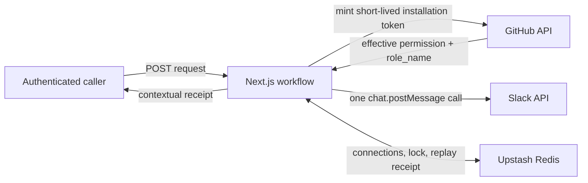

# GitHub Access Request Triage

A small integration app that checks a person’s effective GitHub repository
permission, posts an approval-ready summary to Slack, and returns a contextual
execution receipt.

The workflow stops at the human decision boundary. It never grants, changes, or
revokes GitHub access.

## Demo coordinates

- Deployed app: **set after the Vercel project is claimed and configured**
- Demo Slack channel: `DEMO_SLACK_CHANNEL_ID` from the deployment environment
  (replace the example value `C0123456789` with the real `#access-requests`
  channel ID before the live demo)
- Trigger: `POST /api/access-requests`
- Readiness: `GET /api/status`

The webhook secret is intentionally not committed. Send the rotatable demo
secret with the submission email. Keep the admin password private; the admin
performs reconnects during the demo.

## What it demonstrates

**Core assignment**

- Runtime GitHub App and Slack OAuth connection flows
- A live GitHub read and Slack write
- A configurable, authenticated HTTP trigger
- Compact or detailed execution receipts
- Public, read-only readiness inspection
- Clear validation and provider failure behavior

**Deliberate extensions**

- Timing-safe Bearer-secret comparison
- AES-256-GCM encryption for the stored Slack bot token
- Owner-safe request replay protection after a confirmed Slack post
- A public status surface that exposes no identities or request content

**Not built**

- Run history, queues, automatic retries, multi-tenancy, interactive Slack
  approvals, automatic permission changes, KMS, or full observability

## Architecture



Only static app credentials and security keys live in Vercel environment
variables. Runtime connection state lives in Redis:

- GitHub: verified installation ID and non-secret display metadata. The app
  mints short-lived installation tokens when a workflow runs.
- Slack: bot token encrypted with AES-256-GCM, using a new 12-byte IV and
  workspace-bound additional authenticated data.
- Idempotency: five-minute owner-scoped processing records and 24-hour
  replayable results.
- Status: latest known provider verification times and the last confirmed Slack
  post time.

## Local setup

### 1. Install

Requirements: Node.js 20+, pnpm, one GitHub App, one Slack app, and one Upstash
Redis database.

```bash
pnpm install
cp .env.example .env.local
openssl rand -base64 32
```

Put the generated key in `TOKEN_ENCRYPTION_KEY`, then complete the remaining
values in `.env.local`.

### 2. Configure the GitHub App

Use these settings:

- Homepage URL: `APP_BASE_URL`
- Setup URL:
  `APP_BASE_URL/api/integrations/github/setup`
- Callback URL:
  `APP_BASE_URL/api/integrations/github/callback`
- Request user authorization during installation: **disabled**
- Repository permissions: **Metadata — read-only**
- Installation target: select only the demo repository

The connect flow is deliberately two-stage:

1. The admin starts an installation using a signed, ten-minute, single-use
   state value.
2. The setup callback begins an explicit GitHub user OAuth exchange with PKCE.
3. The app uses the temporary user token to prove the installation belongs to
   that user, discards the token, proves it can mint an installation token, and
   only then replaces the stored connection.

The `installation_id` supplied to a setup callback is not trusted on its own.
A failed reconnect leaves the prior working connection unchanged.

### 3. Configure the Slack app

Use:

- Redirect URL:
  `APP_BASE_URL/api/integrations/slack/callback`
- Bot scope: `chat:write`
- Token rotation: **disabled**

Token rotation is intentionally out of scope because it introduces 12-hour
access tokens and refresh-token coordination. The callback rejects a rotating
token rather than silently storing a connection that will expire during the
demo.

Install the app in the isolated demo workspace. Invite the bot to
`#access-requests`, copy that channel’s ID, and set the same value in
`DEMO_SLACK_CHANNEL_ID`.

### 4. Run

```bash
pnpm dev
```

Open `http://localhost:3000`, sign in with `ADMIN_PASSWORD`, then connect GitHub
and Slack. No source change or redeployment is needed to replace either
connection.

## Environment variables

| Variable | Purpose |
| --- | --- |
| `APP_BASE_URL` | Exact local or deployed origin used in OAuth redirects |
| `ADMIN_PASSWORD` | Shared password for the private setup surface |
| `SESSION_SECRET` | HMAC key for signed admin sessions and OAuth state |
| `WEBHOOK_SECRET` | Rotatable Bearer secret for the trigger |
| `TOKEN_ENCRYPTION_KEY` | Base64-encoded 32-byte AES key |
| `GITHUB_APP_ID` | Numeric GitHub App ID |
| `GITHUB_APP_SLUG` | Slug used by the GitHub installation URL |
| `GITHUB_CLIENT_ID` | GitHub App OAuth client ID |
| `GITHUB_CLIENT_SECRET` | GitHub App OAuth client secret |
| `GITHUB_PRIVATE_KEY` | GitHub App private key; literal or escaped newlines work |
| `SLACK_CLIENT_ID` | Slack app client ID |
| `SLACK_CLIENT_SECRET` | Slack app client secret |
| `DEMO_SLACK_CHANNEL_ID` | Real channel ID shown on the private setup page |
| `UPSTASH_REDIS_REST_URL` | Upstash REST endpoint |
| `UPSTASH_REDIS_REST_TOKEN` | Upstash REST token |
| `NEXT_PUBLIC_APP_VERSION` | Optional local version label |

## Public API

### Readiness

```bash
curl --silent "$APP_BASE_URL/api/status" | jq
```

`status` is `ready` only when the latest stored state for both integrations is
`connected`; otherwise it is `degraded`. `lastSuccessfulRunAt` is always
present and is `null` before the first confirmed Slack post.

This endpoint does not mint a GitHub token or live-probe either provider.
Readiness reflects the latest successful OAuth exchange or provider call. A
credential rejection marks the provider invalid; a network outage does not.
Responses use `Cache-Control: no-store`.

### Trigger

Set the two demo values once:

```bash
export ACCESS_TRIAGE_URL="https://replace-with-your-deployment.example"
export ACCESS_TRIAGE_SECRET="sent-separately"
export DEMO_CHANNEL_ID="replace-with-the-real-access-requests-channel-id"
```

Happy path:

```bash
curl --fail-with-body --silent \
  --request POST "$ACCESS_TRIAGE_URL/api/access-requests" \
  --header "Authorization: Bearer $ACCESS_TRIAGE_SECRET" \
  --header "Content-Type: application/json" \
  --data '{
    "githubUsername": "test-requester",
    "repository": "drinman/private-access-demo",
    "requestedPermission": "write",
    "reason": "Needs access to diagnose an integration failure",
    "slackChannel": "'"$DEMO_CHANNEL_ID"'",
    "requestId": "demo-no-access-001",
    "includeDetails": true
  }' | jq
```

Already sufficient:

```bash
curl --fail-with-body --silent \
  --request POST "$ACCESS_TRIAGE_URL/api/access-requests" \
  --header "Authorization: Bearer $ACCESS_TRIAGE_SECRET" \
  --header "Content-Type: application/json" \
  --data '{
    "githubUsername": "drinman",
    "repository": "drinman/private-access-demo",
    "requestedPermission": "read",
    "reason": "Verifies the informational path",
    "slackChannel": "'"$DEMO_CHANNEL_ID"'",
    "requestId": "demo-sufficient-001",
    "includeDetails": true
  }' | jq
```

Replay the happy-path request without a duplicate Slack message:

```bash
curl --include --silent \
  --request POST "$ACCESS_TRIAGE_URL/api/access-requests" \
  --header "Authorization: Bearer $ACCESS_TRIAGE_SECRET" \
  --header "Content-Type: application/json" \
  --data '{
    "githubUsername": "test-requester",
    "repository": "drinman/private-access-demo",
    "requestedPermission": "write",
    "reason": "Needs access to diagnose an integration failure",
    "slackChannel": "'"$DEMO_CHANNEL_ID"'",
    "requestId": "demo-no-access-001",
    "includeDetails": false
  }'
```

The response includes `Idempotency-Replayed: true`. Changing
`includeDetails` only changes the projection; the stored operation does not
run again.

Inaccessible repository:

```bash
curl --silent \
  --request POST "$ACCESS_TRIAGE_URL/api/access-requests" \
  --header "Authorization: Bearer $ACCESS_TRIAGE_SECRET" \
  --header "Content-Type: application/json" \
  --data '{
    "githubUsername": "test-requester",
    "repository": "drinman/repository-that-does-not-exist",
    "requestedPermission": "read",
    "reason": "Verifies the fail-closed lookup path",
    "slackChannel": "'"$DEMO_CHANNEL_ID"'",
    "requestId": "demo-repository-failure-001",
    "includeDetails": true
  }' | jq
```

The result is `GITHUB_REPOSITORY_NOT_ACCESSIBLE`; Slack is not called. Repeat
the exact command to prove the failed ID was released and executed again.

## Input contract

The JSON object is strict; unknown fields and incorrect types are rejected.

| Field | Rule |
| --- | --- |
| `githubUsername` | GitHub-style name, 1–39 characters |
| `repository` | Exactly `owner/repo` |
| `requestedPermission` | `read`, `triage`, `write`, `maintain`, or `admin` |
| `reason` | 1–500 characters |
| `slackChannel` | Slack channel ID beginning with `C` or `G` |
| `requestId` | Optional, 1–100 characters |
| `includeDetails` | Optional boolean; defaults to `false` |

Strings are trimmed. GitHub usernames and repositories are lowercased.
The idempotency fingerprint covers normalized business inputs and excludes
`requestId` and `includeDetails`.

Permission decisions use this order:

```text
none < read < triage < write < maintain < admin
```

GitHub’s `role_name` takes precedence over the legacy `permission` field.
Unknown custom roles are never guessed; they produce `manual_review`.

## Receipt and failure semantics

- `completed`: Slack confirmed the post, the replay result was stored when an
  ID was supplied, and final metadata work succeeded.
- `failed`: no Slack message was confirmed. Deterministic failures delete the
  owned processing record before responding, so the caller can fix the problem
  and immediately reuse the same ID.
- `partial_failure`: Slack confirmed the post, a replay-safe result was stored,
  and a later noncritical metadata step failed. It returns HTTP `200` because
  retrying the side effect would be unsafe.

> `failed` means no Slack message was confirmed and the request ID is immediately retryable. `partial_failure` means Slack posted the message, so the stored result is replayed to prevent duplicates.

Slack rejection and rate limiting are `failed`, never `partial_failure`.
The app reads `Retry-After` but intentionally makes exactly one Slack call;
queues and automatic retry policy are outside this MVP.

Slack membership errors are actionable:

- `SLACK_BOT_NOT_IN_CHANNEL`: invite the bot or use the demo channel above.
- `SLACK_CHANNEL_NOT_FOUND`: verify the channel ID and bot access.

GitHub resource failures remain distinct:

- `GITHUB_USER_NOT_FOUND`
- `GITHUB_REPOSITORY_NOT_ACCESSIBLE`

### Idempotency

When `requestId` is present, the app atomically creates a five-minute
processing record containing the normalized-input fingerprint, start time, and
a unique operation-owner ID.

- Different fingerprint: `409 IDEMPOTENCY_CONFLICT`
- Same fingerprint still running: `409 REQUEST_IN_PROGRESS`
- Same fingerprint with stored result: return it with
  `Idempotency-Replayed: true`

Cleanup and receipt replacement compare the owner record atomically, so an
expired worker cannot delete or overwrite a newer worker’s lock.

The first critical write after Slack success is a provisional replayable
`partial_failure` receipt. The app then updates `lastSuccessfulRunAt` and
promotes the receipt to `completed`. This ordering prevents a later metadata
failure from creating a duplicate post.

There is one honest exactly-once boundary: a process crash immediately after
Slack accepts a message, or a transport timeout with an ambiguous delivery
result, may leave the system unable to prove whether the post exists. For an
ambiguous transport failure the app leaves the processing record until its
five-minute expiry rather than inviting an immediate duplicate. There is no
distributed transaction spanning Slack and Redis.

## Test and verification

```bash
pnpm test
pnpm typecheck
pnpm lint
pnpm build
```

The focused suite covers strict normalization, Bearer authentication,
encryption integrity, permission ranking, custom roles, owner-safe
idempotency, immediate retry after no-post failures, post-success replay,
representation changes on replay, post-delivery partial failure, and public
status redaction.

Before submission, run every published command against the production URL from
a clean browser profile or second machine. Also rehearse:

1. Connect GitHub and Slack without redeploying.
2. Watch `/api/status` move from `degraded` to `ready`.
3. Run no-access and already-sufficient requests.
4. Replay a successful ID and confirm there is no second Slack message.
5. Run and immediately retry the inaccessible-repository case.
6. Use an unjoined channel and confirm the corrective receipt.
7. Reconnect Slack and confirm the verification timestamp changes.

## Deployment

1. Import the repository into Vercel.
2. Add Upstash Redis and every variable in `.env.example`.
3. Set `APP_BASE_URL` to the stable deployment origin.
4. Add that origin’s exact GitHub and Slack callback URLs to both provider
   apps.
5. Redeploy once for static credentials. Future GitHub or Slack reconnects
   change Redis state and require no deployment.

Do not put `WEBHOOK_SECRET` in this repository. Send it separately.

## Build calibration and AI use

The implementation work was timeboxed after a separate planning and review
pass. **Recorded implementation window: replace with the final measured
start/end time before submission.**

I used OpenAI Codex as a pair-programming tool for planning, implementation,
test generation, documentation, and verification. I reviewed the generated
code and own the scope and design decisions. The core assignment remains the
delivery gate; the four safeguards above are contained additions tied to
concrete replay, credential, and public-trigger risks.
