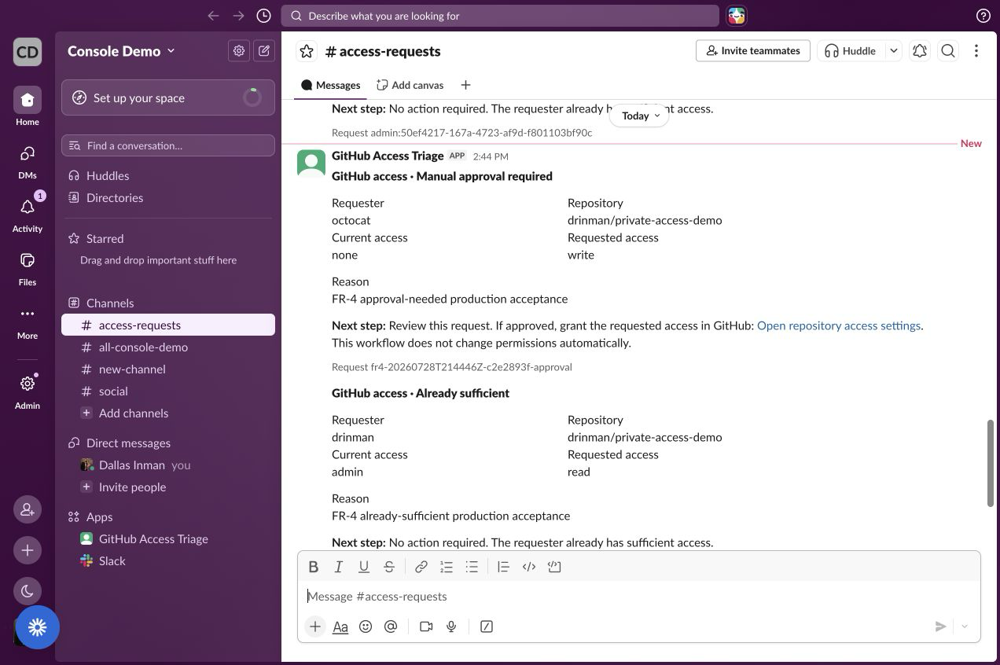
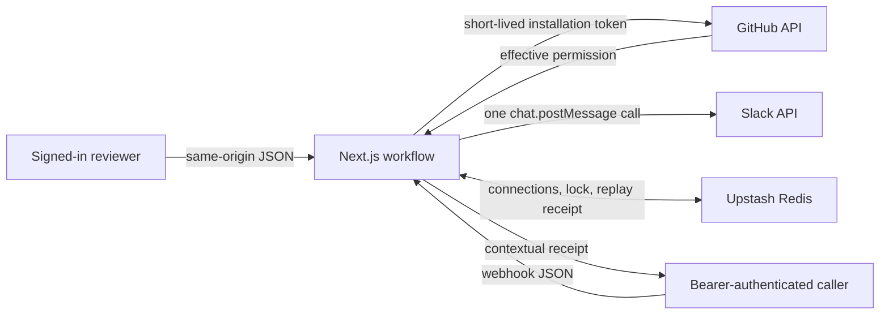

# GitHub Access Request Triage

GitHub Access Request Triage checks a person’s effective permission on one
private GitHub repository, posts a review-ready handoff to Slack, and returns
a contextual execution receipt.

The Slack handoff gives a reviewer a clear next step and, when action is
required, a direct link to the repository’s GitHub access settings. A person
decides what to do and makes any permission change in GitHub. The app never
grants, changes, or revokes access.

## Live demo

| Surface | Value |
| --- | --- |
| Production | https://github-access-triage.vercel.app |
| Public readiness | https://github-access-triage.vercel.app/api/status |
| Human demo | Sign in, then use **Run access check** |
| Machine API | `POST /api/access-requests` |
| Repository | `drinman/private-access-demo` |
| Slack destination | `#access-requests` (`C0BKXAWH6SK`) |

The admin password is shared privately with the reviewer. It opens the
human-operated browser demo and the provider setup controls. The public webhook
is a separate machine contract protected by a rotatable Bearer secret.

## Run it in the browser

1. Open the production URL and enter the admin password shared privately with
   you.
2. Confirm GitHub and Slack are connected.
3. Enter the GitHub username, requested permission, and reason.
4. Select **Run access check** once.

This is a real workflow run, not a preview. Each new run reads GitHub and makes
one Slack post attempt to the configured channel. GitHub remains read-only, the
Slack app still has only `chat:write`, and a person makes any access change. The
browser sends same-origin JSON to `POST /api/admin/access-requests` under the
signed admin session. The server injects the configured repository and Slack
channel; the browser cannot choose another target.

The result card shows the GitHub decision, Slack delivery state, and execution
receipt. If delivery is uncertain, inspect `#access-requests` for the request ID
and do not retry automatically.

## Call the machine webhook

For a machine-to-machine review, set the Bearer secret supplied separately and
generate unique values for this run:

```bash
export ACCESS_TRIAGE_SECRET="replace-with-the-privately-supplied-secret"
export ACCEPTANCE_RUN="readme-$(date -u +%Y%m%d%H%M%S)-$(openssl rand -hex 3)"
export APPROVAL_REQUEST_ID="${ACCEPTANCE_RUN}-approval"
export SUFFICIENT_REQUEST_ID="${ACCEPTANCE_RUN}-sufficient"
export FAILURE_REQUEST_ID="${ACCEPTANCE_RUN}-failure"
export MISSING_GITHUB_USER="missing-$(date -u +%Y%m%d%H%M%S)-$(openssl rand -hex 3)"
```

These four commands cover the main production behaviors. First, request access
for a user with no current permission:

```bash
curl --fail-with-body --silent --show-error \
  --request POST "https://github-access-triage.vercel.app/api/access-requests" \
  --header "Authorization: Bearer $ACCESS_TRIAGE_SECRET" \
  --header "Content-Type: application/json" \
  --data "{
    \"githubUsername\": \"octocat\",
    \"repository\": \"drinman/private-access-demo\",
    \"requestedPermission\": \"write\",
    \"reason\": \"README approval-needed production check\",
    \"slackChannel\": \"C0BKXAWH6SK\",
    \"requestId\": \"$APPROVAL_REQUEST_ID\",
    \"includeDetails\": true
  }" | jq
```

Second, check a user whose current permission is sufficient:

```bash
curl --fail-with-body --silent --show-error \
  --request POST "https://github-access-triage.vercel.app/api/access-requests" \
  --header "Authorization: Bearer $ACCESS_TRIAGE_SECRET" \
  --header "Content-Type: application/json" \
  --data "{
    \"githubUsername\": \"drinman\",
    \"repository\": \"drinman/private-access-demo\",
    \"requestedPermission\": \"read\",
    \"reason\": \"README already-sufficient production check\",
    \"slackChannel\": \"C0BKXAWH6SK\",
    \"requestId\": \"$SUFFICIENT_REQUEST_ID\",
    \"includeDetails\": true
  }" | jq
```

Third, repeat the first request exactly. The response headers include
`Idempotency-Replayed: true`, and the body contains the original run ID and
Slack timestamp:

```bash
curl --fail-with-body --silent --show-error --dump-header /dev/stderr \
  --request POST "https://github-access-triage.vercel.app/api/access-requests" \
  --header "Authorization: Bearer $ACCESS_TRIAGE_SECRET" \
  --header "Content-Type: application/json" \
  --data "{
    \"githubUsername\": \"octocat\",
    \"repository\": \"drinman/private-access-demo\",
    \"requestedPermission\": \"write\",
    \"reason\": \"README approval-needed production check\",
    \"slackChannel\": \"C0BKXAWH6SK\",
    \"requestId\": \"$APPROVAL_REQUEST_ID\",
    \"includeDetails\": true
  }" | jq
```

Fourth, send the same clean failure twice. Both responses are `404`, have
different run IDs, and contain no Slack timestamp, showing that a pre-post
failure releases the request ID for immediate retry:

```bash
for attempt in 1 2; do
  curl --silent --show-error --dump-header /dev/stderr \
    --request POST "https://github-access-triage.vercel.app/api/access-requests" \
    --header "Authorization: Bearer $ACCESS_TRIAGE_SECRET" \
    --header "Content-Type: application/json" \
    --data "{
      \"githubUsername\": \"$MISSING_GITHUB_USER\",
      \"repository\": \"drinman/private-access-demo\",
      \"requestedPermission\": \"read\",
      \"reason\": \"README clean-failure retry check\",
      \"slackChannel\": \"C0BKXAWH6SK\",
      \"requestId\": \"$FAILURE_REQUEST_ID\",
      \"includeDetails\": true
    }" | jq
done
```

The workflow authenticates the caller, reads the person’s effective GitHub
permission, posts one review summary to `#access-requests`, and returns a
contextual receipt. When action is required, the Slack message includes a
direct link to the repository’s GitHub access settings.

These exact four commands were re-run successfully against production on July
28, 2026 at 2:51 PM PT.

Replay protection applies only when `requestId` is supplied: the request ID
becomes replayable for 24 hours after Slack confirms the post or delivery is
indeterminate, while a clean failure releases the ID for immediate reuse.

## Final production acceptance

Production acceptance ran on July 28, 2026 from 2:44 PM to 2:45 PM PT against
runtime commit `663d493aa554dff7e7a3f8b730f511988f81223d`. The documentation-only
commit that contains this evidence does not change the accepted runtime.

| Check | Production evidence |
| --- | --- |
| Browser runner | Signed admin session completed `approval_needed` and rendered receipt `05a2c22a-34fc-4468-a3dc-e149067e1766` |
| `approval_needed` | `octocat` requested `write`; Slack posted the manual handoff and GitHub settings link |
| `already_sufficient` | `drinman` requested `read`; GitHub returned `admin`; Slack said `No action required` without the settings link |
| `manual_review` | Not manufactured live: this personal-account repository cannot provision an organization custom role; permission and workflow unit tests cover the branch |
| Idempotent replay | Same request ID returned the original run ID and Slack timestamp with `Idempotency-Replayed: true`; Slack contained one matching message |
| Failure then retry | The same nonexistent-user request returned two `404 GITHUB_USER_NOT_FOUND` receipts with different run IDs and no Slack post |
| Authentication and validation | Missing Bearer authentication returned `401`; malformed JSON returned `400` |
| Public readiness | `/api/status` returned `ready`, both providers connected, and non-null `lastSuccessfulRunAt` |

The production repository allowlist also returned
`422 GITHUB_REPOSITORY_NOT_ALLOWED` for a different repository before Redis or
either provider was called. The provider-level
`GITHUB_REPOSITORY_NOT_ACCESSIBLE` branch remains covered by unit tests.

See the [redacted receipts and final screenshots](docs/acceptance/final-production-acceptance.md).



## Architecture



Vercel holds static credentials and security keys. Upstash Redis holds runtime
connection state, encrypted Slack credentials, owner-scoped idempotency
records, and the latest successful run time.

### Four design decisions

1. **Connect providers at runtime.** GitHub App installation plus user OAuth
   proves installation ownership. Slack OAuth returns the bot token. Provider
   tokens are never copied into source or returned by an API.
2. **Keep the action narrow.** GitHub is read-only. Slack gets only
   `chat:write`. Production requests are limited to the configured demo
   repository and channel.
3. **Stop before access changes.** The workflow gathers context and posts a
   manual handoff with a direct GitHub settings link when action is required.
   A person makes the decision and any resulting permission change.
4. **Report uncertain delivery honestly.** Owner-scoped idempotency prevents
   normal duplicate posts. The receipt still distinguishes confirmed,
   retryable, partial, and indeterminate outcomes because Slack and Redis do
   not share a transaction.

See [docs/technical-design.md](docs/technical-design.md) for the OAuth proof,
permission model, idempotency state machine, failure semantics, and security
boundaries.

## Build process

Built with AI-assisted tooling for planning and code generation, with review
loops on every design decision. This mirrors how I work day to day. I’m happy
to walk through the process in the debrief.

## Local setup and OAuth

### Requirements

- Node.js `24.x`
- pnpm `10.34.5`
- One GitHub App
- One Slack app in an isolated workspace
- One Upstash Redis database

### Install

```bash
corepack enable
pnpm install
cp .env.example .env.local
```

Generate the four application secrets locally:

```bash
openssl rand -base64 24
openssl rand -hex 32
openssl rand -hex 32
openssl rand -base64 32
```

Use those values, in order, for `ADMIN_PASSWORD`, `SESSION_SECRET`,
`WEBHOOK_SECRET`, and `TOKEN_ENCRYPTION_KEY`. Do not commit them. Share only the
admin password and, when the machine API is being reviewed, the webhook secret
through a private channel. Provider credentials, the encryption key, and
Upstash credentials remain deployment secrets.

### Configure the GitHub App

Use:

- Homepage URL: `APP_BASE_URL`
- Setup URL: `APP_BASE_URL/api/integrations/github/setup`
- Callback URL: `APP_BASE_URL/api/integrations/github/callback`
- Redirect on update: enabled
- Repository permission: Metadata, read-only
- Installation target: only the repository in `DEMO_GITHUB_REPOSITORY`

The first connection installs the app, then verifies the installation through
GitHub user OAuth with PKCE. An existing connection can be reverified without
changing its repository selection. Changing installation scope is a separate,
explicit action. A failed reconnect does not replace a working connection.

### Configure Slack

Use:

- Redirect URL: `APP_BASE_URL/api/integrations/slack/callback`
- Bot scope: `chat:write`
- Token rotation: disabled

Install the app in the isolated workspace and invite the bot to
`#access-requests`. The `chat:write` scope does not make the bot a channel
member.

### Environment variables

| Variable | Purpose |
| --- | --- |
| `APP_BASE_URL` | Exact local or production origin used in OAuth redirects |
| `ADMIN_PASSWORD` | Password for the private setup surface |
| `SESSION_SECRET` | HMAC key for admin sessions and OAuth state |
| `WEBHOOK_SECRET` | Rotatable Bearer secret for the trigger |
| `TOKEN_ENCRYPTION_KEY` | Base64-encoded 32-byte AES key |
| `GITHUB_APP_ID` | Numeric GitHub App ID |
| `GITHUB_APP_SLUG` | GitHub App slug |
| `GITHUB_CLIENT_ID` | GitHub OAuth client ID |
| `GITHUB_CLIENT_SECRET` | GitHub OAuth client secret |
| `GITHUB_PRIVATE_KEY` | GitHub App private key |
| `DEMO_GITHUB_REPOSITORY` | Only repository accepted by the production trigger |
| `SLACK_CLIENT_ID` | Slack app client ID |
| `SLACK_CLIENT_SECRET` | Slack app client secret |
| `DEMO_SLACK_CHANNEL_ID` | Only Slack channel accepted by the production trigger |
| `UPSTASH_REDIS_REST_URL` | Upstash REST endpoint |
| `UPSTASH_REDIS_REST_TOKEN` | Upstash REST token |
| `NEXT_PUBLIC_APP_VERSION` | Optional local version label |

Start the app:

```bash
pnpm dev
```

Open `http://localhost:3000`, sign in with `ADMIN_PASSWORD`, connect GitHub and
Slack, then use the browser runner or the machine API.

## API contract

### Browser runner

`POST /api/admin/access-requests` is the human demo path. It requires the signed
admin session established at login and accepts same-origin JSON only. The
browser supplies the request details and a stable submission ID. The server
injects `DEMO_GITHUB_REPOSITORY`, `DEMO_SLACK_CHANNEL_ID`, and detailed receipt
mode before calling the same workflow used by the public API.

The runner disables concurrent submission and does not automatically retry a
Slack write. A timeout can hide a successful Slack post, so an uncertain receipt
requires a manual channel check.

### Readiness

```bash
curl --silent \
  "https://github-access-triage.vercel.app/api/status" | jq
```

`status` is `ready` when both stored provider connections are `connected`.
Otherwise it is `degraded`. The endpoint is public, read-only, uncached, and
does not expose credentials, identities, or request content.

### Machine webhook input

`POST /api/access-requests` remains the machine contract. It requires the
rotatable Bearer secret. Its JSON object is strict; unknown fields and incorrect
types are rejected.

| Field | Rule |
| --- | --- |
| `githubUsername` | GitHub-style name, 1 to 39 characters |
| `repository` | Exactly `owner/repo` with no `.` or `..` path segment |
| `requestedPermission` | `read`, `triage`, `write`, `maintain`, or `admin` |
| `reason` | 1 to 500 characters |
| `slackChannel` | Slack channel ID beginning with `C` or `G` |
| `requestId` | Optional, 1 to 100 characters |
| `includeDetails` | Optional boolean, default `false` |

Strings are trimmed. GitHub usernames and repository names are lowercased.
Production rejects repositories and channels that do not match the configured
demo targets before reading Redis or calling either provider.

GitHub permission decisions use:

```text
none < read < triage < write < maintain < admin
```

GitHub’s `role_name` takes precedence over the legacy `permission` field. An
unknown custom role produces `manual_review`; the app does not guess its rank.

### Receipt states

| State | Meaning | Caller action |
| --- | --- | --- |
| `completed` | Slack confirmed the post and finalization completed | Store the receipt |
| `failed` | No Slack message was confirmed | Fix the reported cause, then retry |
| `partial_failure` | Slack posted, but noncritical finalization failed | Do not retry; replay exists only if `requestId` was supplied |
| `indeterminate` | Delivery or replay protection could not be confirmed | Do not retry automatically |

Replay protection applies only when `requestId` is supplied: the request ID
becomes replayable for 24 hours after Slack confirms the post or delivery is
indeterminate, while a clean failure releases the ID for immediate reuse. The
five-minute processing lease protects an in-flight request. Without a request
ID, a retry may duplicate the Slack post.

Useful error codes include:

- `GITHUB_REPOSITORY_NOT_ALLOWED`
- `GITHUB_REPOSITORY_SCOPE_REQUIRED`
- `SLACK_CHANNEL_NOT_ALLOWED`
- `GITHUB_REPOSITORY_NOT_ACCESSIBLE`
- `GITHUB_USER_NOT_FOUND`
- `GITHUB_PROVIDER_ERROR`
- `GITHUB_CONNECTION_REQUIRED`
- `SLACK_BOT_NOT_IN_CHANNEL`
- `SLACK_CHANNEL_NOT_FOUND`
- `IDEMPOTENCY_CONFLICT`
- `REQUEST_IN_PROGRESS`
- `SLACK_DELIVERY_UNKNOWN`

## Assumptions and non-goals

This is a single-tenant take-home deployment. One admin manages one GitHub App
installation, one Slack workspace, one repository, and one channel.

The current scope does not include:

- automatic GitHub permission changes
- interactive Slack approve or deny buttons
- multi-tenant account isolation
- queues or automatic provider retries
- run-history UI
- KMS-backed key management
- per-caller rate limits inside the application

The signed admin session controls the human browser runner. The Bearer secret
controls the public machine trigger. Custom per-source rate limits would belong
in Vercel Firewall; this take-home does not claim they are configured.

## Verification

Production acceptance on July 28, 2026 confirmed:

1. A complete signed-in browser run rendered its production receipt.
2. An approval-needed GitHub read posted the manual handoff and settings link.
3. An already-sufficient GitHub read posted the no-action message without that
   link.
4. The custom-role `manual_review` branch is covered by unit tests and is not
   misrepresented as a live personal-repository result.
5. A replay returned the original run and Slack timestamp without another post.
6. A clean failure released its request ID and reran immediately.
7. Missing authentication returned `401`, and malformed JSON returned `400`.
8. `/api/status` returned `ready` with a non-null `lastSuccessfulRunAt`.

Repository checks:

```bash
pnpm test
pnpm typecheck
pnpm lint
pnpm build
pnpm audit --prod
```

The 127-test local gate covers the browser and machine authentication
boundaries, workflow receipts, provider behavior, typecheck, lint, the
production build, and the production dependency audit. `pnpm audit --prod`
reports no known vulnerabilities.

A full development dependency audit still reports
`GHSA-mh99-v99m-4gvg` through `eslint > minimatch > brace-expansion`. That path
is not part of the production runtime. Its fix requires a newer transitive
dependency than the current ESLint range resolves, so this submission does not
force an incompatible major override.

CI runs the same five gates on pushes to `main`, pull requests, and manual
dispatches.

## Deployment

1. Import the repository into Vercel.
2. Add every variable from `.env.example` to Production.
3. Set `APP_BASE_URL` to the exact production origin.
4. Add that origin’s exact GitHub and Slack callback URLs to both apps.
5. Redeploy so the new environment variables reach the runtime.
6. Connect both providers and confirm `/api/status` returns `ready`.

Share the admin password privately with the reviewer. If the machine contract is
also being exercised, share its rotatable `WEBHOOK_SECRET` separately. Keep
provider credentials, `SESSION_SECRET`, `TOKEN_ENCRYPTION_KEY`, and Upstash
credentials private to the deployment.
