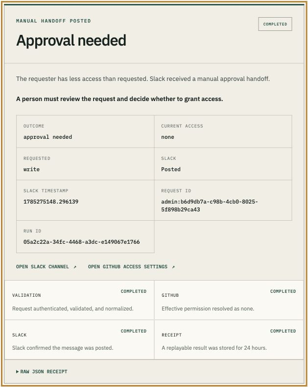
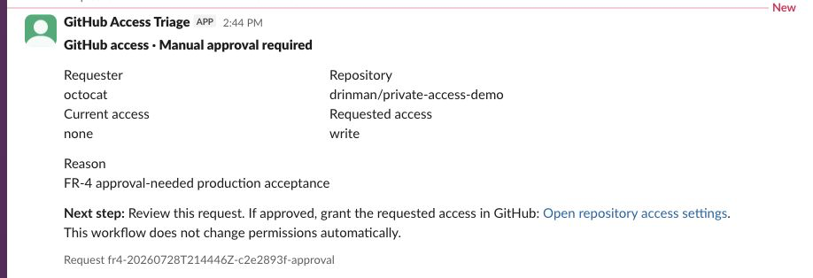
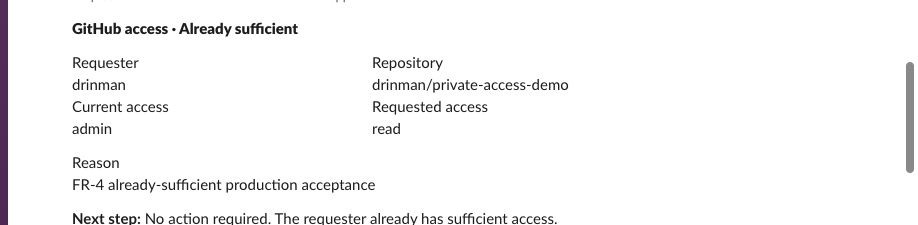

# Final production acceptance

Production acceptance ran on July 28, 2026 from 2:44 PM to 2:45 PM PT against
runtime commit `663d493aa554dff7e7a3f8b730f511988f81223d`.

Acceptance was executed against runtime commit `663d493`; commits between
`663d493` and submission evidence commit `847d738` modify documentation and
screenshots only, verified by diff. The forward commit adding this clarification
also changes documentation only.

These receipts contain no credentials. The Bearer secret, admin password,
provider credentials, encryption key, and Upstash credentials were not
captured.

## Browser runner

The signed-in browser runner completed an `approval_needed` request and rendered
the receipt in the admin console.



```json
{
  "status": "completed",
  "outcome": "approval_needed",
  "runId": "05a2c22a-34fc-4468-a3dc-e149067e1766",
  "requestId": "admin:b6d9db7a-c98b-4cb0-8025-5f898b29ca43",
  "requestedAt": "2026-07-28T21:45:47.634Z",
  "completedAt": "2026-07-28T21:45:48.333Z",
  "summary": "The requester has less access than requested. Slack received a manual approval handoff.",
  "github": {
    "username": "octocat",
    "repository": "drinman/private-access-demo",
    "requestedPermission": "write",
    "effectivePermission": "none",
    "roleName": null
  },
  "slack": {
    "channel": "C0BKXAWH6SK",
    "posted": true,
    "messageTs": "1785275148.296139"
  }
}
```

## Approval needed

The machine API returned HTTP `200`. Slack contained exactly one message with
this request ID after the original call and replay.



```json
{
  "status": "completed",
  "outcome": "approval_needed",
  "runId": "e4b19d03-859f-4cf4-9973-873841aeb39b",
  "requestId": "fr4-20260728T214446Z-c2e2893f-approval",
  "requestedAt": "2026-07-28T21:44:49.795Z",
  "completedAt": "2026-07-28T21:44:50.503Z",
  "summary": "The requester has less access than requested. Slack received a manual approval handoff.",
  "github": {
    "username": "octocat",
    "repository": "drinman/private-access-demo",
    "requestedPermission": "write",
    "effectivePermission": "none",
    "roleName": null
  },
  "slack": {
    "channel": "C0BKXAWH6SK",
    "posted": true,
    "messageTs": "1785275090.467299"
  }
}
```

The Slack message said `Manual approval required`, gave the reviewer a clear
next step, linked directly to
`https://github.com/drinman/private-access-demo/settings/access`, and stated
that the workflow does not change permissions automatically.

## Already sufficient

The machine API returned HTTP `200`. GitHub reported `admin`, which exceeds the
requested `read` permission.



```json
{
  "status": "completed",
  "outcome": "already_sufficient",
  "runId": "a5da47e1-8ed8-497f-b078-2d19ed958d5f",
  "requestId": "fr4-20260728T214446Z-c2e2893f-sufficient",
  "requestedAt": "2026-07-28T21:44:50.872Z",
  "completedAt": "2026-07-28T21:44:51.561Z",
  "summary": "The requester already has sufficient access. Slack received an informational message.",
  "github": {
    "username": "drinman",
    "repository": "drinman/private-access-demo",
    "requestedPermission": "read",
    "effectivePermission": "admin",
    "roleName": "admin"
  },
  "slack": {
    "channel": "C0BKXAWH6SK",
    "posted": true,
    "messageTs": "1785275091.524609"
  }
}
```

The Slack message said `No action required` and did not contain the repository
access-settings link.

## Idempotent replay

Repeating the approval-needed request with the same `requestId` returned HTTP
`200` with `Idempotency-Replayed: true`. The replay returned the original run
ID and Slack timestamp:

```json
{
  "status": "completed",
  "outcome": "approval_needed",
  "runId": "e4b19d03-859f-4cf4-9973-873841aeb39b",
  "requestId": "fr4-20260728T214446Z-c2e2893f-approval",
  "slack": {
    "channel": "C0BKXAWH6SK",
    "posted": true,
    "messageTs": "1785275090.467299"
  }
}
```

Slack contained one message with that request ID, confirming that the replay
did not post again.

## Clean failure and retry

A nonexistent GitHub user produced HTTP `404 GITHUB_USER_NOT_FOUND`. Slack was
not called. Repeating the identical request with the same request ID produced a
second run ID and the same clean failure, proving that the ID was released for
immediate retry.

```json
[
  {
    "status": "failed",
    "runId": "6ec06901-d263-4c4d-bc35-6a7fe21c98a7",
    "requestId": "fr4-20260728T214446Z-c2e2893f-failure",
    "error": {
      "code": "GITHUB_USER_NOT_FOUND",
      "message": "The supplied GitHub user was not found."
    },
    "slack": {
      "channel": "C0BKXAWH6SK",
      "posted": false,
      "messageTs": null
    }
  },
  {
    "status": "failed",
    "runId": "8a61303b-240c-4b0f-8939-16f1c9928382",
    "requestId": "fr4-20260728T214446Z-c2e2893f-failure",
    "error": {
      "code": "GITHUB_USER_NOT_FOUND",
      "message": "The supplied GitHub user was not found."
    },
    "slack": {
      "channel": "C0BKXAWH6SK",
      "posted": false,
      "messageTs": null
    }
  }
]
```

The production allowlist prevents callers from submitting a different
repository far enough to exercise the provider-level
`GITHUB_REPOSITORY_NOT_ACCESSIBLE` branch. A different repository failed closed
before Redis or provider calls:

```json
{
  "httpStatus": 422,
  "status": "failed",
  "error": {
    "code": "GITHUB_REPOSITORY_NOT_ALLOWED",
    "message": "This deployment is limited to its configured demo repository."
  }
}
```

The provider-level inaccessible-repository path remains covered by unit tests.

## Authentication and validation

Missing Bearer authentication returned:

```json
{
  "httpStatus": 401,
  "status": "failed",
  "error": {
    "code": "UNAUTHORIZED",
    "message": "A valid Bearer credential is required."
  }
}
```

An authenticated malformed JSON body returned:

```json
{
  "httpStatus": 400,
  "status": "failed",
  "error": {
    "code": "VALIDATION_ERROR",
    "message": "The request body must be valid JSON."
  }
}
```

## Manual review

The demo repository is owned by the personal account `drinman`. GitHub custom
repository roles are [an organization
feature](https://docs.github.com/en/enterprise-cloud@latest/organizations/managing-user-access-to-your-organizations-repositories/managing-repository-roles/about-custom-repository-roles),
so the demo cannot provision a genuine custom-role subject without changing
the repository and account model. The `manual_review` decision remains covered
by the [permission tests](../../src/lib/__tests__/schema-permissions.test.ts)
and [workflow tests](../../src/lib/__tests__/workflow.test.ts). It was not
claimed as live production evidence.

## Final status

```json
{
  "status": "ready",
  "integrations": {
    "github": {
      "status": "connected",
      "lastVerifiedAt": "2026-07-28T21:44:51.207Z"
    },
    "slack": {
      "status": "connected",
      "lastVerifiedAt": "2026-07-28T21:44:51.556Z"
    }
  },
  "lastSuccessfulRunAt": "2026-07-28T21:44:51.561Z",
  "version": "663d493aa554dff7e7a3f8b730f511988f81223d"
}
```
