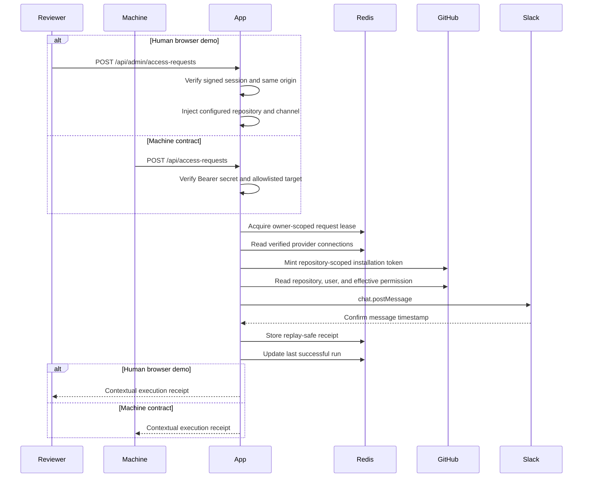
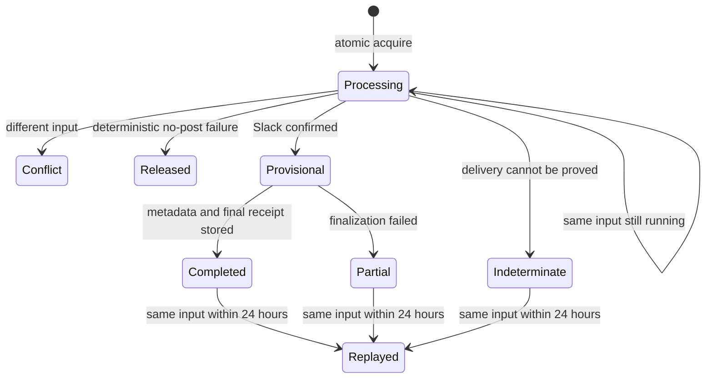

# Technical Design

This note records the workflow guarantees and failure boundaries behind the
short reviewer path in the README.

## Request sequence



The app calls Slack at most once during a workflow attempt. It does not retry a
Slack write because a transport timeout can hide a successful post.

## Trigger surfaces

### Human browser runner

The admin console is the human-operated demo path. Login establishes a signed,
HTTP-only admin session. The runner sends same-origin JSON to
`POST /api/admin/access-requests`; the server checks the session and request
origin before parsing the body.

The browser supplies the requester, requested permission, reason, and stable
submission ID. The server injects the configured repository, configured Slack
channel, and detailed receipt mode. Client input therefore cannot turn the
runner into a general repository lookup or Slack posting surface.

Selecting **Run access check** authorizes one real workflow run and one Slack
post attempt. The browser disables concurrent submission. Neither the route nor
the client automatically retries uncertain Slack delivery.

### Machine webhook

`POST /api/access-requests` remains the machine-to-machine contract. It uses a
rotatable Bearer secret and the strict parameterized JSON schema. Repository and
channel values must still match the configured production targets.

Both surfaces call the same validation, permission, idempotency, provider, and
receipt logic. The browser route does not call the public route and never
exposes the Bearer secret.

## Provider connections

### GitHub

The GitHub App has read-only Metadata permission. The initial connection uses
two proofs:

1. GitHub returns an installation ID through the signed setup callback.
2. User OAuth with PKCE proves the same user can see that installation.

The temporary user token is discarded after verification. The app stores the
installation ID and non-secret display metadata in Redis. Each workflow mints
a short-lived installation token scoped to the configured repository and
`metadata:read`.

Reverification uses the stored installation ID and a new PKCE user OAuth
exchange. Changing installation scope returns to the GitHub installation flow.
The app commits a new connection only after verification succeeds, so a failed
reconnect leaves the previous connection intact.

The production installation must use selected repositories and include exactly
the repository configured by `DEMO_GITHUB_REPOSITORY`.

### Slack

Slack OAuth requests only `chat:write`. The callback accepts a bot token only
when the response identifies a bot token and reports exactly that scope.
Rotating credentials are rejected because refresh-token coordination is
outside this demo.

The bot token is encrypted before Redis storage with AES-256-GCM. Each
encryption uses a new 12-byte IV. The Slack team ID is additional authenticated
data, which binds the ciphertext to its workspace record.

Slack does not add a bot to a channel when it grants `chat:write`. An admin
must invite the bot to the configured channel.

## Target boundary

The trigger accepts repository and channel fields because the assignment asks
for a parameterized endpoint. In production, those parameters must equal:

- `DEMO_GITHUB_REPOSITORY`
- `DEMO_SLACK_CHANNEL_ID`

The application checks this allowlist before reading connection state, minting
a GitHub token, or calling Slack. This keeps a leaked webhook secret from
turning the demo into a general GitHub lookup or Slack posting proxy.

The GitHub provider also parses and encodes the repository owner and name
before building request URLs. Complete `.` and `..` path segments are invalid.
Names such as `.github` and `repo.name` remain valid.

## Permission decision

The workflow reads three GitHub resources:

1. The repository, to prove the installation can access it.
2. The GitHub user, to distinguish a nonexistent account.
3. The collaborator permission endpoint, to read effective access.

The rank is:

```text
none < read < triage < write < maintain < admin
```

GitHub’s `role_name` takes precedence over its legacy `permission` value. A
recognized role is compared with the requested rank. An unknown custom role is
reported as `manual_review` because assigning it a rank would invent policy.

The decisions are:

| Decision | Condition |
| --- | --- |
| `approval_needed` | Effective access is below requested access |
| `already_sufficient` | Effective access meets or exceeds requested access |
| `manual_review` | GitHub returned an unknown custom role |

The Slack card includes the requester, repository, current access, requested
access, reason, decision, run ID, and a clear manual next step. For
approval-required and manual-review outcomes, it includes a direct link to the
repository’s GitHub access settings. It does not contain credentials. A person
reviews the context and makes any access decision or change in GitHub.

## Idempotency state machine

`requestId` is optional in the machine contract to preserve a small, convenient
HTTP interface. Supplying one enables duplicate protection. The browser runner
always supplies a stable generated request ID for its submission.

The input fingerprint covers normalized business fields. It excludes
`requestId` and `includeDetails`. A compact replay and a detailed replay are
different projections of the same operation.



The processing record has a five-minute lease, an operation-owner ID, and an
input fingerprint. Cleanup and receipt replacement compare the owner record
atomically. An expired worker cannot delete or overwrite a newer worker’s
record.

After Slack confirms a post, the first critical Redis write is a provisional,
replayable receipt. The app then updates `lastSuccessfulRunAt` and promotes the
receipt to `completed`. If a later step fails, the stored receipt prevents a
caller from creating a normal duplicate.

Without `requestId`, there is no processing lease or replay record. The receipt
states that duplicate protection was not requested and that a retry may
duplicate the Slack post.

## Receipt and failure semantics

### Deterministic failure before a Slack confirmation

The app returns `failed` and releases the owned request record. The caller can
correct the problem and immediately reuse the same request ID.

Examples include invalid authentication, rejected input, inaccessible
repository, unknown GitHub user, provider rejection, and a Slack response that
explicitly says `ok: false`.

A `2xx` GitHub permission response is accepted only when it contains a
nonempty `role_name` or legacy `permission`. Otherwise the app returns
`GITHUB_PROVIDER_ERROR` and does not call Slack.

### Confirmed Slack post

`completed` means Slack returned a nonempty message timestamp and finalization
succeeded.

`partial_failure` means Slack confirmed the post and, when `requestId` was
supplied, the replay-safe result was stored, but later metadata work failed.
Without `requestId`, the receipt explicitly states that no replay protection
exists. The response uses HTTP `200` because an automatic retry would risk
another approval card.

### Indeterminate delivery and replay

A timeout, network error after request transmission, or malformed successful
Slack response cannot prove whether Slack accepted the post. The app returns an
`indeterminate` receipt with `SLACK_DELIVERY_UNKNOWN`.

When `requestId` is present, the app atomically replaces the processing lease
with that indeterminate receipt for the standard 24-hour replay TTL. A retry
with the same request ID returns the stored receipt without reading GitHub or
attempting another Slack post. An unconfirmed side effect must be treated as if
it may exist. Releasing the lease would invite the duplicate post that the
request ID exists to prevent. The reviewer reconciles the result by searching
the configured Slack channel for the request ID already included in the
message.

Without `requestId`, the app returns the same indeterminate receipt but has no
lease or replay record to manage. Replay protection requires a request ID. If
Redis cannot persist the indeterminate result, the receipt says that storage
could not be confirmed and the caller still must not retry automatically.

### Unconfirmed replay protection

If Slack confirms the post but Redis cannot confirm the first replay record,
the receipt is `indeterminate` with
`RECEIPT_PERSISTENCE_UNCONFIRMED`. It does not claim replay safety.

There is no distributed transaction across Slack and Redis. The receipt makes
that limit visible instead of claiming exactly-once delivery.

## Timeouts and status changes

Each external request gets a fresh timeout:

- GitHub and Slack provider calls: 10 seconds
- GitHub and Slack OAuth calls: 10 seconds
- Upstash Redis calls: 5 seconds

A deterministic credential rejection marks that provider connection invalid.
A GitHub network timeout is a retryable provider error and does not mark the
connection invalid because an outage does not prove the credential is bad.
Reconnection failures also preserve the previous connection.

`GET /api/status` reads stored state only. It does not mint a GitHub token or
probe either provider. The endpoint returns:

- provider state: `connected`, `invalid`, or `disconnected`
- provider verification times
- `lastSuccessfulRunAt`
- the deployed commit version when available

It returns `Cache-Control: no-store` and no provider identities, request
content, or credentials.

## Production authorization boundary

This demo stops at a manual Slack handoff. In a production authorization
system, Slack identifies the actor; the identity provider resolves current
employment, manager, and group membership; the policy engine authorizes the
request; and a narrowly scoped executor provisions the permission and records
the audit trail. Keeping those responsibilities separate prevents the Slack
message itself from becoming the source of authorization.

## Security boundaries

- The trigger SHA-256 hashes the supplied and expected Bearer secrets, then
  compares the equal-length digests with `crypto.timingSafeEqual`.
- The browser runner requires a signed admin session and same-origin JSON.
- Browser-supplied input cannot select the repository or Slack channel.
- Admin sessions and OAuth state use HMAC signatures.
- OAuth state is short-lived and single-use.
- GitHub user OAuth uses PKCE.
- Slack tokens are encrypted at rest.
- GitHub installation tokens are short-lived and repository-scoped.
- Production repository and Slack channel are allowlisted.
- Provider responses are shape-checked before the app trusts their contents.
- Error responses do not include raw provider tokens or secrets.

The admin password may be shared privately with an authorized reviewer so they
can use the human demo. Provider credentials, `SESSION_SECRET`,
`TOKEN_ENCRYPTION_KEY`, and Upstash credentials remain private to the
deployment and are never rendered in the browser.

## Known limits

This deployment is intentionally single tenant. It has a human browser runner
but no automatic GitHub write, Slack buttons, job queue, automatic provider
retry, run-history UI, application-level per-caller rate limiter, or KMS
integration.

The five-minute processing lease is recovery state, not a global exactly-once
guarantee. A process can still fail at the boundary between Slack accepting a
message and Redis recording that fact.
